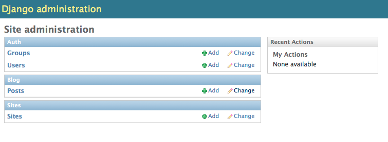
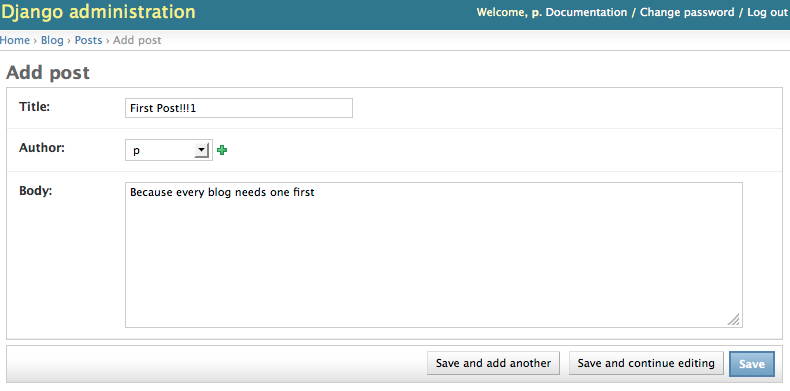
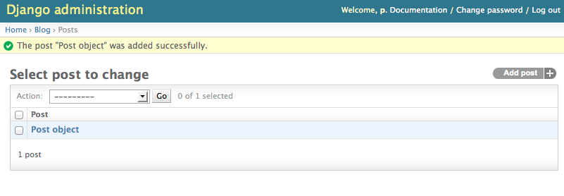

Models
======

Creating an app
---------------

It is generally a good practice to separate your Django projects into multiple specialized (and sometimes reusable) apps. Additionally every Django model must live in an app so you'll need at least one app for your project.

Let's create an app for blog posts and related models.  We'll call the app ``blog``:

.. code-block:: bash

    $ python manage.py startapp blog

This command should have created a ``blog`` directory with the following files::

    __init__.py
    models.py
    tests.py
    views.py

We'll be focusing on the ``models.py`` file below.

Before we can use our app we need to add it to our ``INSTALLED_APPS`` in our settings file (``myblog/settings.py``).  This will allow Django to discover the models in our ``models.py`` file so they can be added to the database when running syncdb.

.. code-block:: python

    INSTALLED_APPS = (
        'django.contrib.auth',
        'django.contrib.contenttypes',
        'django.contrib.sessions',
        'django.contrib.sites',
        'django.contrib.messages',
        'django.contrib.staticfiles',
        'django.contrib.admin',

        'blog',
    )

.. NOTE::
    Just to make sure we are on the same page, your project structure should
    look like this:

    ::

        ├── blog
        │   ├── __init__.py
        │   ├── models.py
        │   ├── tests.py
        │   └── views.py
        ├── manage.py
        ├── myblog
        │   ├── __init__.py
        │   ├── settings.py
        │   ├── urls.py
        │   └── wsgi.py
        └── myblog.sqlite3

Creating a model
----------------

First let's create a blog post model.  This will correspond to a database table which will hold our blog posts.  A blog post will be represented by an instance of our ``Post`` model class and each ``Post`` model instance will identify a row in our database table.

.. code-block:: python

    from django.db import models

    class Post(models.Model):
        title = models.CharField(max_length=500)
        author = models.ForeignKey('auth.User')
        body = models.TextField()
        created_at = models.DateTimeField(auto_now_add=True, editable=False)
        modified_at = models.DateTimeField(auto_now=True, editable=False)

If you aren't already familiar with databases, this code may be somewhat daunting. A good way to think about a model (or a database table) is as a sheet in a spreadsheet. Each field like the ``title`` or ``author`` is a column in the spreadsheet and each different instance of the model -- each individual blog post in our project -- is a row in the spreadsheet.

To create the database table for our ``Post`` model we need to run syncdb again:

.. code-block:: bash

    $ python manage.py syncdb

.. TIP::
    If you notice, this code is written in a very particular way. There are
    two blank lines between imports and class definitions and the code is
    spaced very particularly. There is a style guide for Python known as
    `PEP8`_. A central tenet of Python is that code is read more frequently
    than it is written. Consistent code style helps developers read and
    understand a new project more quickly.

    .. _PEP8: http://www.python.org/dev/peps/pep-0008/

Creating posts from the admin site
----------------------------------

We don't want to manually add posts to the database every time we want to update our blog.  It would be nice if we could use a login-secured webpage to create blog posts.  Fortunately Django's admin interface can do just that.

In order to create blog posts from the admin interface we need to register our Post model with the admin site.  We can do this by creating a new ``blog/admin.py`` file with the following code:

.. code-block:: python

    from django.contrib import admin
    from .models import Post

    admin.site.register(Post)

Now, start up the development server again and navigate to the admin site (http://localhost:8000/admin/) and create a blog post.

.. code-block:: bash

    $ python manage.py runserver

First click the "Add" link next to *Posts* in the admin site.

Next fill in the details for our first blog post and click the *Save* button.

Our post was created

Our first test: __unicode__ method
----------------------------------

In the admin change list our posts all have the unhelpful name *Post object*.  We can customize the way models are referenced by creating a ``__unicode__`` method on our model class. Models are a good place to put this kind of reusable code that is specific to a model.

Let's first create a test demonstrating the behavior we'd like to see.

All the tests for our app will live in the ``blog/tests.py`` file. Delete everything in that file and start over with a failing test:

.. code-block:: python

    from django.test import TestCase

    class PostModelTest(TestCase):

        def test_unicode_representation(self):
            self.fail("TODO Test incomplete")

Now run the test command to ensure our app's single test fails as expected:

.. code-block:: bash

    $ python manage.py test blog

::

    Creating test database for alias 'default'...
    F
    ======================================================================
    FAIL: test_unicode_representation (blog.tests.PostModelTest)
    ----------------------------------------------------------------------
    Traceback (most recent call last):
    ...
    AssertionError: TODO Test incomplete

    ----------------------------------------------------------------------
    Ran 1 test in 0.001s

    FAILED (failures=1)
    Destroying test database for alias 'default'...

If we read the output carefully, the ``manage.py test`` command did a few things. First, it created a test database. This is important because we wouldn't want tests to actually modify our real database. Secondly, it executed each "test" in ``blog/tests.py``. If all goes well, the test runner isn't very chatty, but when failures occur like in our test, the test runner prints lots of information to help you debug your failing test.

Now we're ready to create a real test.

.. TIP::
    There are lots of resources on unit testing but a great place to start is
    the official Python documentation on the `unittest`_ module and the
    `Testing Django applications`_ docs. They also have good recommendations
    on naming conventions which is why our test classes are named like
    ``SomethingTest`` and our methods named ``test_something``. Because many
    projects adopt similar conventions, developers can more easily understand
    the code.

    .. _unittest: http://docs.python.org/2.7/library/unittest.html
    .. _Testing Django applications: https://docs.djangoproject.com/en/1.5/topics/testing/overview/

Let's write our test to ensure that a blog post's unicode representation is equal to its title.  We need to modify our tests file like so:

.. code-block:: python

    from django.test import TestCase
    from .models import Post

    class PostModelTest(TestCase):

        def test_unicode_representation(self):
            post = Post(title="My post title")
            self.assertEqual(unicode(post), post.title)

.. HINT::
    ``__unicode__`` may seem like a strange name, but Unicode is a standard
    for representing and encoding most of the world's writing systems and
    character sets. All strings that Django passes around are Unicode strings
    so that Django can be used for applications designed for different
    languages.

Now let's run our tests again:

.. code-block:: bash

    $ python manage.py test blog

::

    Creating test database for alias 'default'...
    F
    ======================================================================
    FAIL: test_unicode_representation (blog.tests.PostModelTest)
    ----------------------------------------------------------------------
    Traceback (most recent call last):
    ...
    AssertionError: u'Post object' != 'My post title'

    ----------------------------------------------------------------------
    Ran 1 test in 0.001s

    FAILED (failures=1)
    Destroying test database for alias 'default'...

Our test fails again, but this time it fails because we haven't customized our ``__unicode__`` method yet so the unicode representation for our model is still the default *Post object*.

Let's add a ``__unicode__`` method to our model that returns the post title.  Our ``models.py`` file should look something like this:

.. code-block:: python

    from django.db import models

    class Post(models.Model):
        title = models.CharField(max_length=500)
        author = models.ForeignKey('auth.User')
        body = models.TextField()
        created_at = models.DateTimeField(auto_now_add=True, editable=False)
        modified_at = models.DateTimeField(auto_now=True, editable=False)

        def __unicode__(self):
            return self.title

If you start the development server and take a look at the admin interface (http://localhost:8000/admin/) again, you will see the post titles in the list of posts.

Now if we run our test again we should see that our single test passes:

.. code-block:: bash

    $ python manage.py test blog

::

    Creating test database for alias 'default'...
    .
    ----------------------------------------------------------------------
    Ran 1 test in 0.001s

    OK
    Destroying test database for alias 'default'...

We've just written our first test and fixed our code to make our test pass.

Test Driven Development (TDD) is all about writing a failing test and then making it pass. If you were to write your code first, then write tests, it's harder to know that the test you wrote really does test what you want it to.

While this may seem like a trivial example, good tests are a way to document the expected behavior of a program. A great test suite is a sign of a mature application since bits and pieces can be changed easily and the tests will ensure that the program still works as intended. The Django framework itself has a massive unit test suite with thousands of tests.
