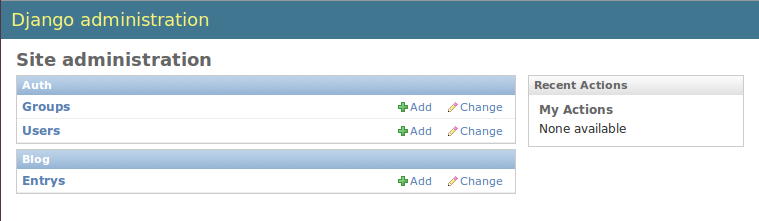
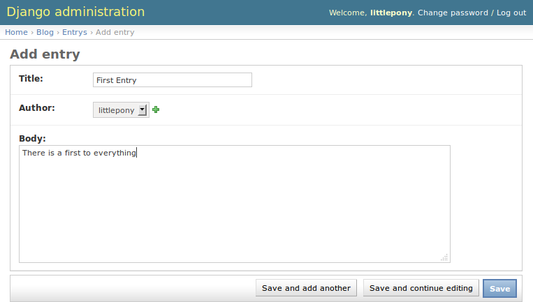
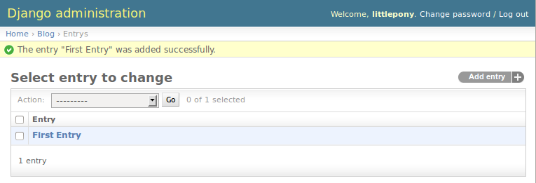

Models
======

Creating an app
---------------

It is generally a good practice to separate your Django projects into multiple specialized (and sometimes reusable) apps. Additionally every Django model must live in an app so you'll need at least one app for your project.

Let's create an app for blog entries and related models.  We'll call the app ``blog``:

.. code-block:: bash

    $ python manage.py startapp blog

This command should have created a ``blog`` directory with the following files and a subdirectory, migrations::

    __init__.py
    admin.py
    migrations
    models.py
    tests.py
    views.py

We'll be focusing on the ``models.py`` file below.

Before we can use our app we need to add it to our ``INSTALLED_APPS`` in our settings file (``myblog/settings.py``).  This will allow Django to discover the models in our ``models.py`` file so they can be added to the database when running migrate.

.. code-block:: python

    INSTALLED_APPS = (
        'django.contrib.admin',
        'django.contrib.auth',
        'django.contrib.contenttypes',
        'django.contrib.sessions',
        'django.contrib.messages',
        'django.contrib.staticfiles',

        'blog',
    )

.. NOTE::
    Just to make sure we are on the same page, your project structure should
    look like this:

    ::

        ├── blog
        │   ├── admin.py
        │   ├── __init__.py
        │   ├── migrations
        │   │   └── __init__.py
        │   ├── models.py
        │   ├── tests.py
        │   └── views.py
        ├── db.sqlite3
        ├── manage.py
        ├── myblog
        │   ├── __init__.py
        │   ├── settings.py
        │   ├── urls.py
        │   └── wsgi.py
        └── requirements.txt

Creating a model
----------------

First, let's create a blog entry model by writing the code below in our
`blog/models.py` file. Models are objects used to interface with your
data, and are described in the `Django model documentation`_. Our model
will correspond to a database table which will hold the data for our
blog entry. A blog entry will be represented by an instance of our
``Entry`` model class and each ``Entry`` model instance will identify a
row in our database table.

.. _Django model documentation: https://docs.djangoproject.com/en/1.7/topics/db/models/

.. code-block:: python

    from django.db import models

    class Entry(models.Model):
        title = models.CharField(max_length=500)
        author = models.ForeignKey('auth.User')
        body = models.TextField()
        created_at = models.DateTimeField(auto_now_add=True, editable=False)
        modified_at = models.DateTimeField(auto_now=True, editable=False)

If you aren't already familiar with databases, this code may be somewhat daunting. A good way to think about a model (or a database table) is as a sheet in a spreadsheet. Each field like the ``title`` or ``author`` is a column in the spreadsheet and each different instance of the model -- each individual blog entry in our project -- is a row in the spreadsheet.

To create the database table for our ``Entry`` model we need to make a migration and run migrate again:

.. code-block:: bash

    $ python manage.py makemigrations
    $ python manage.py migrate

Don't worry about the details of migrations just yet, we'll learn about them in a later section of the tutorial. For now, just think of migrations as Django's way of managing changes to models and the corresponding database.

.. TIP::
    If you notice, this code is written in a very particular way. There are
    two blank lines between imports and class definitions and the code is
    spaced very particularly. There is a style guide for Python known as
    `PEP8`_. A central tenet of Python is that code is read more frequently
    than it is written. Consistent code style helps developers read and
    understand a new project more quickly.

    .. _PEP8: http://legacy.python.org/dev/peps/pep-0008/

Creating entries from the admin site
------------------------------------

We don't want to manually add entries to the database every time we want to update our blog.  It would be nice if we could use a login-secured webpage to create blog entries.  Fortunately Django's admin interface can do just that.

In order to create blog entries from the `admin interface`_ we need to register our ``Entry`` model with the admin site.  We can do this by modifying our ``blog/admin.py`` file to register the ``Entry`` model with the admin interface:

.. _admin interface: https://docs.djangoproject.com/en/1.7/ref/contrib/admin/

.. code-block:: python

    from django.contrib import admin

    from .models import Entry

    admin.site.register(Entry)

Now, start up the development server again and navigate to the admin site (http://localhost:8000/admin/) and create a blog entry.

.. code-block:: bash

    $ python manage.py runserver

First click the "Add" link next to *Entries* in the admin site.

Next fill in the details for our first blog entry and click the *Save* button.

Our blog entry was created

Our first test: __str__ method
----------------------------------

In the admin change list our entries have the unhelpful title
*Entry object*. Add another entry just like the first one, they will
look identical. We can customize the way models are referenced by
creating a ``__str__`` method on our model class. Models are a good
place to put this kind of reusable code that is specific to a model.

Let's first create a test demonstrating the behavior we'd like to see.

All the tests for our app will live in the ``blog/tests.py`` file. Delete everything in that file and start over with a failing test:

.. code-block:: python

    from django.test import TestCase

    class EntryModelTest(TestCase):

        def test_string_representation(self):
            self.fail("TODO Test incomplete")

Now run the test command to ensure our app's single test fails as expected:

.. code-block:: bash

    $ python manage.py test blog

::

    Creating test database for alias 'default'...
    F
    ======================================================================
    FAIL: test_string_representation (blog.tests.EntryModelTest)
    ----------------------------------------------------------------------
    Traceback (most recent call last):
    ...
    AssertionError: TODO Test incomplete

    ----------------------------------------------------------------------
    Ran 1 test in 0.001s

    FAILED (failures=1)
    Destroying test database for alias 'default'...

If we read the output carefully, the ``manage.py test`` command did a few things. First, it created a test database. This is important because we wouldn't want tests to actually modify our real database. Secondly, it executed each "test" in ``blog/tests.py``. If all goes well, the test runner isn't very chatty, but when failures occur like in our test, the test runner prints lots of information to help you debug your failing test.

Now we're ready to create a real test.

.. TIP::
    There are lots of resources on unit testing but a great place to start is
    the official Python documentation on the `unittest`_ module and the
    `Testing Django applications`_ docs. They also have good recommendations
    on naming conventions which is why our test classes are named like
    ``SomethingTest`` and our methods named ``test_something``. Because many
    projects adopt similar conventions, developers can more easily understand
    the code.

    .. _unittest: http://docs.python.org/2.7/library/unittest.html
    .. _Testing Django applications: https://docs.djangoproject.com/en/1.7/topics/testing/overview/

.. NOTE::
   `django.test.TestCase` extends the `unittest.TestCase` class.
   Anything you would do in the base `unittest` class will work in
   Django's `TestCase` as well.

   You can read more about `django.test.TestCase`_ in the Django documentation and the `unittest.TestCase`_ parent class in the Python documentation.

   .. _django.test.TestCase: https://docs.djangoproject.com/en/1.7/topics/testing/tools/#django.test.TestCase
   .. _unittest.TestCase: https://docs.python.org/3.4/library/unittest.html#unittest.TestCase

Let's write our test to ensure that a blog entry's string representation is equal to its title.  We need to modify our tests file like so:

.. code-block:: python

    from django.test import TestCase

    from .models import Entry

    class EntryModelTest(TestCase):

        def test_string_representation(self):
            entry = Entry(title="My entry title")
            self.assertEqual(str(entry), entry.title)

Now let's run our tests again:

.. code-block:: bash

    $ python manage.py test blog

::

    Creating test database for alias 'default'...
    F
    ======================================================================
    FAIL: test_string_representation (blog.tests.EntryModelTest)
    ----------------------------------------------------------------------
    Traceback (most recent call last):
    ...
    AssertionError: 'Entry object' != 'My entry title'
    - Entry object
    + My entry title

    ----------------------------------------------------------------------
    Ran 1 test in 0.002s

    FAILED (failures=1)
    Destroying test database for alias 'default'...

Our test fails again, but this time it fails because we haven't customized our ``__str__`` method yet so the string representation for our model is still the default *Entry object*.

Let's add a ``__str__`` method to our model that returns the entry title.  Our ``models.py`` file should look something like this:

.. code-block:: python

    from django.db import models

    class Entry(models.Model):
        title = models.CharField(max_length=500)
        author = models.ForeignKey('auth.User')
        body = models.TextField()
        created_at = models.DateTimeField(auto_now_add=True, editable=False)
        modified_at = models.DateTimeField(auto_now=True, editable=False)

        def __str__(self):
            return self.title

If you start the development server and take a look at the admin interface (http://localhost:8000/admin/) again, you will see the entry titles in the list of entries.

.. image:: _static/02-04_entry_w_name.png

Now if we run our test again we should see that our single test passes:

.. code-block:: bash

    $ python manage.py test blog

::

    Creating test database for alias 'default'...
    .
    ----------------------------------------------------------------------
    Ran 1 test in 0.000s

    OK
    Destroying test database for alias 'default'...

We've just written our first test and fixed our code to make our test pass.

Test Driven Development (TDD) is all about writing a failing test and then making it pass. If you were to write your code first, then write tests, it's harder to know that the test you wrote really does test what you want it to.

While this may seem like a trivial example, good tests are a way to document the expected behavior of a program. A great test suite is a sign of a mature application since bits and pieces can be changed easily and the tests will ensure that the program still works as intended. The Django framework itself has a massive unit test suite with thousands of tests.

Another Test: Entrys
--------------------

Did you notice that the pluralization of entry is misspelled in the admin interface?  "Entrys" should instead read "Entries".  Let's write a test to verify that when Django correctly pluralizes "entry" to "entries".

.. image:: _static/02-05_entrys_spelling.png

Let's add a test to our ``EntryModelTest`` class:

.. code-block:: python

    def test_verbose_name_plural(self):
        self.assertEqual(str(Entry._meta.verbose_name_plural), "entries")

.. NOTE::

    This test uses the model ``_meta`` class (created based on the ``Meta`` class we will define).  This is an example of an advanced Django feature.  The ``_meta`` class is currently undocumented.

Now let's make our test pass by specifying the verbose name for our model.

Add a ``Meta`` inner class inside our ``Entry`` model, like this:

.. code-block:: python

    class Entry(models.Model):

        # The rest of our model code

        class Meta:
            verbose_name_plural = "entries"

.. HINT::

    See the Django documentation for information on `verbose_name_plural`_ in the Meta class.

.. _verbose_name_plural: https://docs.djangoproject.com/en/1.7/ref/models/options/#verbose-name-plural
