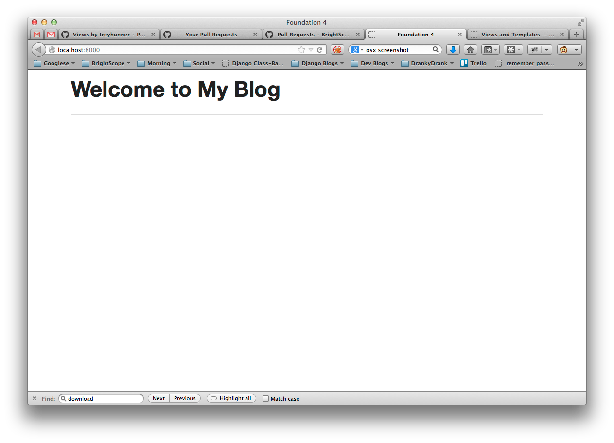

Views and Templates
===================

Now we can create blog posts and see them in the admin interface, but no one else can see our blog posts yet.

The homepage test
-----------------

Every site should have a homepage. Let's write a failing test for that.

We can use the Django `test client`_ to create a test to make sure that our homepage returns an HTTP 200 status code (this is the standard response for a successful HTTP request).

Let's add the following to our ``blog/tests.py`` file:

.. code-block:: python

    class ProjectTests(TestCase):

        def test_homepage(self):
            response = self.client.get('/')
            self.assertEqual(response.status_code, 200)

If we run our tests now this test should fail because we haven't created a homepage yet.

.. HINT::
    There's lots more information on the `hypertext transfer protocol`_
    (HTTP) and its various `status codes`_ on Wikipedia. Quick reference,
    200 = OK; 404 = Not Found; 500 = Server Error

Base template and static files
------------------------------

Let's start with base templates based on zurb foundation.  First download and extract the `Zurb Foundation files`_ (`direct link`_).

Zurb Foundation is a CSS, HTML and JavaScript framework for building the
front-end of web sites. Rather than attempt to design a web site entirely from
scratch, Foundation gives a good starting place on which to design and build
an attractive, standards-compliant web site that works well across devices
such as laptops, tablets and phones.

Static files
~~~~~~~~~~~~

Create a ``static`` directory in our top-level directory (the one with the ``manage.py`` file).  Copy the ``css`` directory from the foundation archive to this new ``static`` directory.

Now let's add this new ``static`` directory to our ``myblog/settings.py`` file:

.. code-block:: python

    STATICFILES_DIRS = (
        os.path.join(BASE_DIR, 'static'),
    )

For more details, see Django's documentation on `static files`_.

.. IMPORTANT::
    This workshop is focused on Python and Django and so out of necessity we
    are going to gloss over explaining HTML, CSS and JavaScript a little bit.
    However, virtually all websites have a front-end built with these
    fundamental building blocks of the open web.

Template files
~~~~~~~~~~~~~~

Templates are a way to dynamically generate a number of documents which are
similar but have some data that is slightly different. In the blogging system
we are building, we want all of our blog posts to look visually similar but
the actual text of a given blog post varies. We will have a single template
for what all of our blog posts and the template will contain variables that
get replaced when a blog post is rendered. This reuse that Django helps with
and the concept of keeping things in a single place is called the DRY
principle for Don't Repeat Yourself.

Create a ``templates`` directory in our top-level directory. Our directory structure should look like

.. code-block:: bash

        ├── blog
        │   ├── __init__.py
        │   ├── admin.py
        │   ├── models.py
        │   ├── tests.py
        │   └── views.py
        ├── manage.py
        ├── myblog
        │   ├── __init__.py
        │   ├── settings.py
        │   ├── urls.py
        │   ├── views.py
        │   └── wsgi.py
        ├── myblog.sqlite3
        ├── static
        │   └── css
        │       ├── foundation.css
        │       ├── foundation.min.css
        │       └── normalize.css
        └── templates

Create a basic HTML file like this and name it ``templates/index.html``:

.. code-block:: html

    
    <!DOCTYPE html>
    <html>
    <head>
        <title>Foundation 4</title>
        <link rel="stylesheet" href="">
    </head>
    <body>
        <section class="row">
            <header class="large-12 columns">
                <h1>Welcome to My Blog</h1>
                

            </header>
        </section>
    </body>
    </html>

Now let's add this new ``templates`` directory to our ``myblog/settings.py`` file:

.. code-block:: python

    TEMPLATE_DIRS = (
        os.path.join(BASE_DIR, 'templates'),
    )

For just about everything there is to know about Django templates, read
the `template documentation`_.

.. TIP::
    In our examples, the templates are going to be used to generate similar
    HTML pages. However, Django's template system can be used to generate
    any type of plain text document such as CSS, JavaScript, CSV or XML.

Views
-----

Now let's create a homepage using the ``index.html`` template we added.

Let's start by creating a views file: ``myblog/views.py`` referencing the ``index.html`` template:

.. code-block:: python

    from django.views.generic.base import TemplateView

    class HomeView(TemplateView):

        template_name = 'index.html'

    home = HomeView.as_view()

Django will be able to find this template in the ``templates`` folder because of our ``TEMPLATE_DIRS`` setting.
Now we need to route the homepage URL to the home view.  Our URL file ``myblog/urls.py`` should look something like this:

.. code-block:: python

    from django.conf.urls import patterns, include, url
    from myblog import views

    from django.contrib import admin
    admin.autodiscover()

    urlpatterns = patterns('',
        url(r'^$', views.home),
        url(r'^admin/', include(admin.site.urls)),
    )

Now let's visit http://localhost:8000/ in a web browser to check our work.  You should see a webpage that looks like this:

Great!  Now let's make sure our new test passes:

.. code-block:: bash

    $ python manage.py test blog

::

    Creating test database for alias 'default'...
    ..
    ----------------------------------------------------------------------
    Ran 2 tests in 0.021s

    OK
    Destroying test database for alias 'default'...

.. HINT::
    From a code flow perspective, we now have a working example of how Django
    creates dynamic web pages. When an HTTP request to a Django powered web
    site is sent, the ``urls.py`` file contains a series of patterns for
    matching the URL of that web request. The matching URL delegates the
    request to a corresponding view (or to a another set of URLs which map
    the request to a view). Finally, the view delegates the request to a
    template for rendering the actual HTML.

    In web site architecture, this separation of concerns is variously known
    as a three-tier architecture or a model-view-controller architecture.

Using a base template
~~~~~~~~~~~~~~~~~~~~~

Templates in Django are generally built up from smaller pieces. This lets you include things like a consistent header and footer on all your pages. Convention is to call one of your templates ``base.html`` and have everything inherit from that.

We'll start with putting our header and a sidebar in ``templates/base.html``:

.. code-block:: html

    
    <!DOCTYPE html>
    <html>
    <head>
        <title>Foundation 4</title>
        <link rel="stylesheet" href="">
    </head>
    <body>
        <section class="row">
            <header class="large-12 columns">
                <h1>Welcome to My Blog</h1>
                

            </header>
        </section>

        <section class="row">

            

                
            

            

                <h3>About Me</h3>
                
I am a Python developer and I like Django.

            

        </section>

    </body>
    </html>

.. NOTE::

    We will not explain the CSS classes we used above (e.g. ``large-8``, ``column``, ``row``).  More information on these classes can be found in the Zurb Foundation `grid documentation`_.

Let's put some filler content in ``templates/index.html``:

.. code-block:: html

    

    
    Page body goes here.
    

ListViews
---------

We put a hard-coded title and article in our filler view. These post details should come from our models and database instead. Let's write a test for that.

The Django ``test client`` can be used for a simple test of whether text shows up on a page.  Let's add the following to our ``blog/tests.py`` file:

.. code-block:: python

    from django.contrib.auth import get_user_model

    class ListPostsOnHomePage(TestCase):

        """Test whether our blog posts show up on the homepage"""

        def setUp(self):
            self.user = get_user_model().objects.create(username='some_user')

        def test_one_post(self):
            Post.objects.create(title='1-title', body='1-body', author=self.user)
            response = self.client.get('/')
            self.assertContains(response, '1-title')
            self.assertContains(response, '1-body')

        def test_two_posts(self):
            Post.objects.create(title='1-title', body='1-body', author=self.user)
            Post.objects.create(title='2-title', body='2-body', author=self.user)
            response = self.client.get('/')
            self.assertContains(response, '1-title')
            self.assertContains(response, '1-body')
            self.assertContains(response, '2-title')

which should fail like this

.. code-block:: bash

    Creating test database for alias 'default'...
    FF..
    ======================================================================
    FAIL: test_one_post (blog.tests.ListPostsOnHomePage)
    ----------------------------------------------------------------------
    Traceback (most recent call last):
      ...
    AssertionError: Couldn't find '1-title' in response

    ======================================================================
    FAIL: test_two_posts (blog.tests.ListPostsOnHomePage)
    ----------------------------------------------------------------------
    Traceback (most recent call last):
      ...
    AssertionError: Couldn't find '1-title' in response

    ----------------------------------------------------------------------
    Ran 4 tests in 0.201s

    FAILED (failures=2)
    Destroying test database for alias 'default'...

Updating our views
~~~~~~~~~~~~~~~~~~

One easy way to get all our posts objects to list is to just use a ``ListView``. That changes our ``HomeView`` only slightly.

.. code-block:: python

    from django.views.generic import ListView

    from blog.models import Post

    class HomeView(ListView):
        template_name = 'index.html'
        queryset = Post.objects.order_by('-created_at')

    home = HomeView.as_view()

That small change will provide a ``post_list`` object to our template ``index.html`` which we can then loop over. For some quick documentation on all the Class Based Views in django, take a look at `Classy Class Based Views`_

The last change needed then is just to update our ``index.html`` to actually put those blog posts in there.

.. code-block:: html

    
        <article>

            <h2><a href="{{ post.get_absolute_url }}">{{ post.title }}</a></h2>

            

                <time>{{ post.modified_at|date }}</time>
            

            

            {{ post.body|linebreaks }}

        </article>
    

Running the tests here we see that all the tests pass!

.. NOTE::

    Read the Django `built-in template tags and filters`_ documentation for more details on the `linebreaks`_ and `date`_ template filters.

And now, if we add some posts in our admin, they should show up on the homepage. What happens if there are no posts?
We should add a test for that

.. code-block:: python

    def test_no_posts(self):
        response = self.client.get('/')
        self.assertContains(response, 'No blog post entries yet.')

And that gives us the expected failure

.. code-block:: bash

    Creating test database for alias 'default'...
    F....
    ======================================================================
    FAIL: test_no_posts (blog.tests.ListPostsOnHomePage)
    ----------------------------------------------------------------------
    Traceback (most recent call last):
      ...
    AssertionError: Couldn't find 'No blog post entries yet' in response

    ----------------------------------------------------------------------
    Ran 5 tests in 0.044s

    FAILED (failures=1)
    Destroying test database for alias 'default'...

The easiest way to add this is to use the `empty`_ clause. See if you can add this in yourself to make the test pass.

What about viewing an individual blog post?

Blog Post Details
-----------------

To save a bit of time let's make our urls look like ``http://myblog.com/post/ID/`` where ID is the database ID of the blog post we want to see.

Before we create this page, let's move the template content that displays our blog posts on our homepage into a separate template file so we can reuse it on our blog post details page.

Let's make a file called ``templates/_post.html`` and put the following in it:

.. code-block:: html

    <article>

        <h2><a href="{{ post.get_absolute_url }}">{{ post.title }}</a></h2>

        

            <time>{{ post.modified_at|date }}</time>
        

        

        {{ post.body|linebreaks }}

    </article>

.. NOTE::

    The ``post.get_absolute_url`` reference doesn't do anything yet.  Later we will add a ``get_absolute_url`` method to the post model which will make these links work.

.. TIP::

    The filename of our includable template starts with ``_`` by convention.  This naming convention is recommended by Harris Lapiroff in `An Architecture for Django Templates`_.

Now let's change our homepage template (``templates/index.html``) to include the template file we just made:

.. code-block:: html

    

    
        
            
        
            
No blog post entries yet.

        
    

.. TIP::

    We use the ``with=post only`` convention in our ``include`` for better encapsulation (as mentioned in `An Architecture for Django Templates`_).  Check the Django documentation more information on the `include tag`_.

Let's write a test for that:

.. code-block:: python

    from django.contrib.auth import get_user_model

    class BlogPostViewTest(TestCase):

        def setUp(self):
            self.user = get_user_model().objects.create(username='some_user')
            self.post = Post.objects.create(title='1-title', body='1-body',
                                            author=self.user)

        def test_basic_view(self):
            response = self.client.get(self.post.get_absolute_url())
            self.assertEqual(response.status_code, 200)

This test fails beacuse we didn't define get_absolute_url (`Django Model Instance Documentation`_). We need to create a URL and a view for blog post pages now. We'll need to create a ``blog/urls.py`` file and reference it in the ``myblog/urls.py`` file.

Our ``blog/urls.py`` file is the very short

.. code-block:: python

    from django.conf.urls import patterns, url

    urlpatterns = patterns('blog.views',
        url(r'^post/(?P<pk>\d+)/$', 'post_details'),
    )

The urlconf in ``myblog/urls.py`` needs to reference ``blog.urls``:

.. code-block:: python

    url(r'^', include('blog.urls')),

Now we need to define a ``post_details`` view in our ``blog/views.py`` file:

.. code-block:: python

    from django.http import HttpResponse

    def post_details(request, pk):
        return HttpResponse('empty')

We'll be updating this view later to return something useful.

Finally we need to create the ``get_absolute_url()`` function which should return the post details URL for each posts. We should create a test first.  Let's add the following test to our ``PostModelTest`` class:

.. code-block:: python

    def test_get_absolute_url(self):
        user = get_user_model().objects.create(username='some_user')
        post = Post.objects.create(title="My post title", author=user)
        self.assertIsNotNone(post.get_absolute_url())

Now we need to implement ``get_absolute_url`` in our ``Post`` class (found in ``blog/models.py``):

.. code-block:: python

    from django.core.urlresolvers import reverse

    # And in our Post model class...

    def get_absolute_url(self):
        return reverse('blog.views.post_details', kwargs={'pk': self.pk})

We should now have passing tests again.

Let's make the blog post details page actually display a blog post.  First we'll write some tests in our ``BlogPostViewTest`` class:

.. code-block:: python

    def test_blog_title_in_post(self):
        response = self.client.get(self.post.get_absolute_url())
        self.assertContains(response, self.post.title)

    def test_blog_body_in_post(self):
        response = self.client.get(self.post.get_absolute_url())
        self.assertContains(response, self.post.body)

To implement our blog post page we'll use another class-based generic view: the `DetailView`_. The ``DetailView`` is a view for displaying the details of an instance of a model and rendering it to a template. Let's replace our ``blog/views.py`` file with the following:

.. code-block:: python

    from django.views.generic import DetailView
    from .models import Post

    class PostDetails(DetailView):
        model = Post

    post_details = PostDetails.as_view()

Now we'll see some ``TemplateDoesNotExist`` errors when running our tests again:

.. code-block:: bash

    $ python manage.py test blog

::

    Creating test database for alias 'default'...
    EEE......
    ======================================================================
    ERROR: test_blog_body_in_post (blog.tests.BlogPostViewTest)
    ----------------------------------------------------------------------
    ...
    TemplateDoesNotExist: blog/post_detail.html

    ======================================================================
    ERROR: test_blog_title_in_post (blog.tests.BlogPostViewTest)
    ----------------------------------------------------------------------
    ...
    TemplateDoesNotExist: blog/post_detail.html

    ----------------------------------------------------------------------
    Ran 9 tests in 0.071s

    FAILED (errors=3)
    Destroying test database for alias 'default'...

These errors are telling us that we're referencing a ``blog/post_detail.html`` template but we haven't created that file yet.  Let's create a ``templates/blog/post_detail.html``. The ``DetailView`` should provide us with a ``post`` context variable that we can use to reference our ``Post`` model instance.  Our template should look similar to this:

.. code-block:: html

    

    
        
    

Now our tests should pass again:

.. code-block:: bash

    $ python manage.py test blog

::

    Creating test database for alias 'default'...
    .......
    ----------------------------------------------------------------------
    Ran 8 tests in 0.071s

    OK
    Destroying test database for alias 'default'...

.. _test client: https://docs.djangoproject.com/en/dev/topics/testing/overview/#the-test-client
.. _zurb foundation files: http://foundation.zurb.com/
.. _grid documentation: http://foundation.zurb.com/docs/components/grid.html
.. _direct link: http://foundation.zurb.com/files/foundation-4.3.2.zip
.. _static files: https://docs.djangoproject.com/en/1.5/ref/contrib/staticfiles/
.. _hypertext transfer protocol: http://en.wikipedia.org/wiki/Hypertext_Transfer_Protocol
.. _status codes: http://en.wikipedia.org/wiki/List_of_HTTP_status_codes
.. _template documentation: https://docs.djangoproject.com/en/1.5/topics/templates/
.. _built-in template tags and filters: https://docs.djangoproject.com/en/1.5/ref/templates/builtins/
.. _date: https://docs.djangoproject.com/en/1.5/ref/templates/builtins/#date
.. _linebreaks: https://docs.djangoproject.com/en/1.5/ref/templates/builtins/#linebreaks
.. _Classy Class Based Views: http://ccbv.co.uk
.. _Django Model Instance Documentation: https://docs.djangoproject.com/en/1.5/ref/models/instances/#get-absolute-url
.. _DetailView: http://ccbv.co.uk/projects/Django/1.5/django.views.generic.detail/DetailView/
.. _an architecture for django templates: https://oncampus.oberlin.edu/webteam/2012/09/architecture-django-templates
.. _include tag: https://docs.djangoproject.com/en/1.5/ref/templates/builtins/#include
.. _empty: https://docs.djangoproject.com/en/dev/ref/templates/builtins/#for-empty
