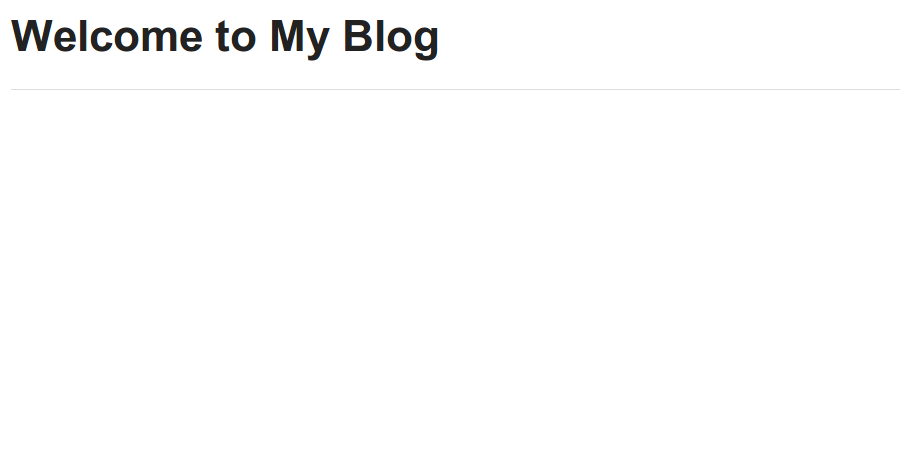

Views and Templates
===================

Now we can create blog entries and see them in the admin interface, but no one else can see our blog entries yet.

The homepage test
-----------------

Every site should have a homepage. Let's write a failing test for that.

We can use the Django `test client`_ to create a test to make sure that our homepage returns an HTTP 200 status code (this is the standard response for a successful HTTP request).

Let's add the following to our ``blog/tests.py`` file:

.. code-block:: python

    class ProjectTests(TestCase):

        def test_homepage(self):
            response = self.client.get('/')
            self.assertEqual(response.status_code, 200)

If we run our tests now this test should fail because we haven't created a homepage yet.

.. HINT::
    There's lots more information on the `hypertext transfer protocol`_
    (HTTP) and its various `status codes`_ on Wikipedia. Quick reference,
    200 = OK; 404 = Not Found; 500 = Server Error

Base template and static files
------------------------------

Let's start with base templates based on zurb foundation.  First download and extract the `Zurb Foundation files`_ (`direct link`_).

Zurb Foundation is a CSS, HTML and JavaScript framework for building the
front-end of web sites. Rather than attempt to design a web site entirely from
scratch, Foundation gives a good starting place on which to design and build
an attractive, standards-compliant web site that works well across devices
such as laptops, tablets and phones.

Static files
~~~~~~~~~~~~

Create a ``static`` directory in our top-level directory (the one with the ``manage.py`` file).  Copy the ``css`` directory from the foundation archive to this new ``static`` directory.

Now let's add this new ``static`` directory definition to the bottom of our ``myblog/settings.py`` file:

.. code-block:: python

    STATICFILES_DIRS = (
        os.path.join(BASE_DIR, 'static'),
    )

For more details, see Django's documentation on `static files`_.

.. IMPORTANT::
    This workshop is focused on Python and Django and so out of necessity we
    are going to gloss over explaining HTML, CSS and JavaScript a little bit.
    However, virtually all websites have a front-end built with these
    fundamental building blocks of the open web.

Template files
~~~~~~~~~~~~~~

`Templates`_ are a way to dynamically generate a number of documents which are
similar but have some data that is slightly different. In the blogging system
we are building, we want all of our blog entries to look visually similar but
the actual text of a given blog entry varies. We will have a single template
for what all of our blog entries and the template will contain variables that
get replaced when a blog entry is rendered. This reuse that Django helps with
and the concept of keeping things in a single place is called the DRY
principle for Don't Repeat Yourself.

.. _Templates: https://docs.djangoproject.com/en/1.7/ref/templates/

Create a ``templates`` directory in our top-level directory. Our directory structure should look like

.. code-block:: bash

    ├── blog
    │   ├── admin.py
    │   ├── __init__.py
    │   ├── migrations
    │   │   ├── 0001_initial.py
    │   │   └── __init__.py
    │   ├── models.py
    │   ├── tests.py
    │   └── views.py
    ├── db.sqlite3
    ├── manage.py
    ├── myblog
    │   ├── __init__.py
    │   ├── settings.py
    │   ├── urls.py
    │   └── wsgi.py
    ├── requirements.txt
    ├── static
    │   └── css
    │       ├── foundation.css
    │       ├── foundation.min.css
    │       └── normalize.css
    └── templates

Create a basic HTML file like this and name it ``templates/index.html``:

.. code-block:: html

    
    <!DOCTYPE html>
    <html>
    <head>
        <title>My Blog</title>
        <link rel="stylesheet" href="">
    </head>
    <body>
        <section class="row">
            <header class="large-12 columns">
                <h1>Welcome to My Blog</h1>
                

            </header>
        </section>
    </body>
    </html>

Now inform Django of this new ``templates`` directory by adding this at the bottom of our ``myblog/settings.py`` file:

.. code-block:: python

    # Template files
    # https://docs.djangoproject.com/en/1.7/topics/templates/

    TEMPLATE_DIRS = (
        os.path.join(BASE_DIR, 'templates'),
    )

For just about everything there is to know about Django templates, read
the `template documentation`_.

.. TIP::
    In our examples, the templates are going to be used to generate similar
    HTML pages. However, Django's template system can be used to generate
    any type of plain text document such as CSS, JavaScript, CSV or XML.

Views
-----

Now let's create a homepage using the ``index.html`` template we added.

Let's start by creating a views file: ``myblog/views.py`` referencing the ``index.html`` template:

.. code-block:: python

    from django.views.generic.base import TemplateView

    class HomeView(TemplateView):

        template_name = 'index.html'

.. IMPORTANT::

    We are making this views file in the ``myblog`` project directory (next to the ``myblog/urls.py`` file we are about to change).  We are **not** changing the ``blog/views.py`` file yet.  We will use that file later.

Django will be able to find this template in the ``templates`` folder because of our ``TEMPLATE_DIRS`` setting.
Now we need to route the homepage URL to the home view.  Our URL file ``myblog/urls.py`` should look something like this:

.. code-block:: python

    from django.conf.urls import include, url
    from django.contrib import admin

    from . import views

    urlpatterns = [
        url(r'^$', views.HomeView.as_view(), name='home'),
        url(r'^admin/', include(admin.site.urls)),
    ]

Now let's visit http://localhost:8000/ in a web browser to check our
work. (Restart your server with the command
`python manage.py runserver`.) You should see a webpage that looks like
this:

Great!  Now let's make sure our new test passes:

.. code-block:: bash

    $ python manage.py test blog

::

    Creating test database for alias 'default'...
    ...
    ----------------------------------------------------------------------
    Ran 3 tests in 0.032s

    OK
    Destroying test database for alias 'default'...

.. HINT::
    From a code flow perspective, we now have a working example of how Django
    creates dynamic web pages. When an HTTP request to a Django powered web
    site is sent, the ``urls.py`` file contains a series of patterns for
    matching the URL of that web request. The matching URL delegates the
    request to a corresponding view (or to a another set of URLs which map
    the request to a view). Finally, the view delegates the request to a
    template for rendering the actual HTML.

    In web site architecture, this separation of concerns is variously known
    as a three-tier architecture or a model-view-controller architecture.

Using a base template
~~~~~~~~~~~~~~~~~~~~~

Templates in Django are generally built up from smaller pieces. This lets you include things like a consistent header and footer on all your pages. Convention is to call one of your templates ``base.html`` and have everything inherit from that. Here is more information on `template inheritance with blocks`_.

.. _template inheritance with blocks: https://docs.djangoproject.com/en/1.7/topics/templates/#template-inheritance

We'll start with putting our header and a sidebar in ``templates/base.html``:

.. code-block:: html

    
    <!DOCTYPE html>
    <html>
    <head>
        <title>My Blog</title>
        <link rel="stylesheet" href="">
    </head>
    <body>
        <section class="row">
            <header class="large-12 columns">
                <h1>Welcome to My Blog</h1>
                

            </header>
        </section>

        <section class="row">

            

                
            

            

                <h3>About Me</h3>
                
I am a Python developer and I like Django.

            

        </section>

    </body>
    </html>

.. NOTE::

    We will not explain the CSS classes we used above (e.g. ``large-8``, ``column``, ``row``).  More information on these classes can be found in the Zurb Foundation `grid documentation`_.

There's a lot of duplicate code between our ``templates/base.html`` and
``templates/index.html``. Django's templates provide a way of having templates
inherit the structure of other templates. This allows a template to define
only a few elements, but retain the overall structure of its parent template.

If we update our ``index.html`` template to extend ``base.html`` we can see
this in action.  Delete everything in ``templates/index.html`` and replace it
with the following:

.. code-block:: html

    

    
    Page body goes here.
    

Now our ``templates/index.html`` just overrides the ``content`` block in
``templates/base.html``. For more details on this powerful Django feature,
you can read the documentation on `template inheritance`_.

.. _template inheritance: https://docs.djangoproject.com/en/1.7/topics/templates/#template-inheritance

ListViews
---------

We put a hard-coded title and article in our filler view. These entry information should come from our models and database instead. Let's write a test for that.

The Django ``test client`` can be used for a simple test of whether text shows up on a page.  Let's add the following to our ``blog/tests.py`` file:

.. code-block:: python

    from django.contrib.auth import get_user_model

    class HomePageTests(TestCase):

        """Test whether our blog entries show up on the homepage"""

        def setUp(self):
            self.user = get_user_model().objects.create(username='some_user')

        def test_one_entry(self):
            Entry.objects.create(title='1-title', body='1-body', author=self.user)
            response = self.client.get('/')
            self.assertContains(response, '1-title')
            self.assertContains(response, '1-body')

        def test_two_entries(self):
            Entry.objects.create(title='1-title', body='1-body', author=self.user)
            Entry.objects.create(title='2-title', body='2-body', author=self.user)
            response = self.client.get('/')
            self.assertContains(response, '1-title')
            self.assertContains(response, '1-body')
            self.assertContains(response, '2-title')

which should fail like this

.. code-block:: bash

    Creating test database for alias 'default'...
    ..FF.
    ======================================================================
    FAIL: test_one_entry (blog.tests.HomePageTests)
    ----------------------------------------------------------------------
    Traceback (most recent call last):
      ...
    AssertionError: False is not true : Couldn't find '1-title' in response

    ======================================================================
    FAIL: test_two_entries (blog.tests.HomePageTests)
    ----------------------------------------------------------------------
    Traceback (most recent call last):
      ...
    AssertionError: False is not true : Couldn't find '1-title' in response

    ----------------------------------------------------------------------
    Ran 5 tests in 0.052s

    FAILED (failures=2)
    Destroying test database for alias 'default'...

Updating our views
~~~~~~~~~~~~~~~~~~

One easy way to get all our entries objects to list is to just use a ``ListView``. That changes our ``HomeView`` only slightly.

.. code-block:: python

    from django.views.generic import ListView

    from blog.models import Entry

    class HomeView(ListView):
        template_name = 'index.html'
        queryset = Entry.objects.order_by('-created_at')

.. IMPORTANT::

    Make sure you update your ``HomeView`` to inherit from ``ListView``. Remember this is still ``myblog/views.py``.

That small change will provide a ``entry_list`` object to our template ``index.html`` which we can then loop over. For some quick documentation on all the Class Based Views in django, take a look at `Classy Class Based Views`_

The last change needed then is just to update our homepage template to add the blog entries.  Let's replace our ``templates/index.html`` file with the following:

.. code-block:: html

    

    
        
            <article>

                <h2><a href="{{ entry.get_absolute_url }}">{{ entry.title }}</a></h2>

                

                    <time>{{ entry.modified_at|date }}</time>
                

                

                {{ entry.body|linebreaks }}

            </article>
        
    

.. NOTE::

    The ``entry.get_absolute_url`` reference doesn't do anything yet.  Later we will add a ``get_absolute_url`` method to the entry model which will make these links work.

.. TIP::

    Notice that we didn't specify the name ``entry_list`` in our code.  Django's class-based generic views often add automatically-named variables to your template context based on your model names.   In this particular case the context object name was automatically defined by the `get_context_object_name`_ method in the ``ListView``.  Instead of referencing ``entry_list`` in our template we could have also referenced the template context variable ``object_list`` instead.

Running the tests here we see that all the tests pass!

.. NOTE::

    Read the Django `built-in template tags and filters`_ documentation for more details on the `linebreaks`_ and `date`_ template filters.

And now, if we add some entries in our admin, they should show up on the homepage. What happens if there are no entries?
We should add a test for that

.. code-block:: python

    def test_no_entries(self):
        response = self.client.get('/')
        self.assertContains(response, 'No blog entries yet.')

This test gives us the expected failure

.. code-block:: bash

    Creating test database for alias 'default'...
    ..F...
    ======================================================================
    FAIL: test_no_entries (blog.tests.HomePageTests)
    ----------------------------------------------------------------------
    Traceback (most recent call last):
      ...
    AssertionError: False is not true : Couldn't find 'No blog entries yet.' in response

    ----------------------------------------------------------------------
    Ran 6 tests in 0.044s

    FAILED (failures=1)
    Destroying test database for alias 'default'...

The easiest way to implement this feature is to use the `empty`_ clause. See if you can add this in yourself to make the test pass.

.. HINT::
    Remember that the phrase in the empty clause must contain the same phrase we check for in our test ("No blog entries yet.").

What about viewing an individual blog entry?

Blog Entries, URLs, and Views
-----------------------------

For simplicity, let's agree on a project guideline to form our urls to look like ``http://myblog.com/ID/`` where ID is the database ID of the specific blog entry that we want to display. In this section, we will be creating a `blog entry detail` page and using our project's url guideline.

Before we create this page, let's move the template content that displays our blog entries on our homepage (``templates/index.html``) into a new, separate template file so we can reuse the blog entry display logic on our `blog entry details` page.

Let's make a template file called ``templates/_entry.html`` and put the following in it:

.. code-block:: html

    <article>

        <h2><a href="{{ entry.get_absolute_url }}">{{ entry.title }}</a></h2>

        

            <time>{{ entry.modified_at|date }}</time>
        

        

        {{ entry.body|linebreaks }}

    </article>

.. TIP::

    The filename of our includable template starts with ``_`` by convention.  This naming convention is recommended by Harris Lapiroff in `An Architecture for Django Templates`_.

Now let's change our homepage template (``templates/index.html``) to include the template file we just made:

.. code-block:: html

    

    
        
            
        
            
No blog entries yet.

        
    

.. TIP::

    We use the ``with entry=entry only`` convention in our ``include`` tag for better encapsulation (as mentioned in `An Architecture for Django Templates`_).  Check the Django documentation more information on the `include tag`_.

Great job. Now, let's write a test our new blog entry pages:

.. code-block:: python

    class EntryViewTest(TestCase):

        def setUp(self):
            self.user = get_user_model().objects.create(username='some_user')
            self.entry = Entry.objects.create(title='1-title', body='1-body',
                                              author=self.user)

        def test_basic_view(self):
            response = self.client.get(self.entry.get_absolute_url())
            self.assertEqual(response.status_code, 200)

This test fails because we didn't define the ``get_absolute_url`` method for our ``Entry`` model (`Django Model Instance Documentation`_). We will need an absolute URL to correspond to an individual blog entry.

We need to create a URL and a view for blog entry pages now. We'll make a new ``blog/urls.py`` file and reference it in the ``myblog/urls.py`` file.

Our ``blog/urls.py`` file is the very short:

.. code-block:: python

    from django.conf.urls import url

    from . import views

    urlpatterns = [
        url(r'^(?P<pk>\d+)/$', views.EntryDetail.as_view(), name='entry_detail'),
    ]

The urlconf in ``myblog/urls.py`` needs to reference ``blog.urls``:

.. code-block:: python

    from django.conf.urls import include, url
    from django.contrib import admin

    import blog.urls
    from . import views

    urlpatterns = [
        url(r'^$', views.HomeView.as_view(), name='home'),
        url(r'^', include(blog.urls)),
        url(r'^admin/', include(admin.site.urls)),
    ]

Remember, we are working on creating a way to see individual entries. 
Now we need to define an ``EntryDetail`` view class in our ``blog/views.py``
file. To implement our blog entry page we'll use another class-based
generic view: the `DetailView`_. The ``DetailView`` is a view for
displaying the details of an instance of a model and rendering it to a
template. Let's replace the contents of ``blog/views.py`` file with the following:

.. code-block:: python

    from django.views.generic import DetailView
    from .models import Entry

    class EntryDetail(DetailView):
        model = Entry

Let's look at how to create the ``get_absolute_url()`` function which should return the individual, absolute entry detail URL for each blog entry. We should create a test first.  Let's add the following test to our ``EntryModelTest`` class:

.. code-block:: python

    def test_get_absolute_url(self):
        user = get_user_model().objects.create(username='some_user')
        entry = Entry.objects.create(title="My entry title", author=user)
        self.assertIsNotNone(entry.get_absolute_url())

Now we need to implement our ``get_absolute_url`` method in our ``Entry`` class (found in ``blog/models.py``):

.. code-block:: python

    from django.core.urlresolvers import reverse

    # And in our Entry model class...

    def get_absolute_url(self):
        return reverse('entry_detail', kwargs={'pk': self.pk})

.. TIP::
    For further reading about the utility function, reverse, see the
    Django documentation on `django.core.urlresolvers.reverse`_.

    .. _django.core.urlresolvers.reverse: https://docs.djangoproject.com/en/1.7/ref/urlresolvers/

Now, run the tests again. We should have passing tests since we just defined a ``get_absolute_url`` method.

Let's make the blog entry detail view page actually display a blog entry.  First we'll write some tests in our ``EntryViewTest`` class:

.. code-block:: python

    def test_title_in_entry(self):
        response = self.client.get(self.entry.get_absolute_url())
        self.assertContains(response, self.entry.title)

    def test_body_in_entry(self):
        response = self.client.get(self.entry.get_absolute_url())
        self.assertContains(response, self.entry.body)

Now we'll see some ``TemplateDoesNotExist`` errors when running our tests again:

.. code-block:: bash

    $ python manage.py test blog

::

    Creating test database for alias 'default'...
    ...EEE....
    ======================================================================
    ERROR: test_basic_view (blog.tests.EntryViewTest)
    ----------------------------------------------------------------------
    Traceback (most recent call last):
      ...
    django.template.base.TemplateDoesNotExist: blog/entry_detail.html

    ======================================================================
    ERROR: test_body_in_entry (blog.tests.EntryViewTest)
    ----------------------------------------------------------------------
    Traceback (most recent call last):
      ...
    django.template.base.TemplateDoesNotExist: blog/entry_detail.html

    ======================================================================
    ERROR: test_title_in_entry (blog.tests.EntryViewTest)
    ----------------------------------------------------------------------
    Traceback (most recent call last):
      ...
    django.template.base.TemplateDoesNotExist: blog/entry_detail.html

    ----------------------------------------------------------------------
    Ran 10 tests in 0.136s

    FAILED (errors=3)
    Destroying test database for alias 'default'...

These errors are telling us that we're referencing a ``blog/entry_detail.html`` template but we haven't created that file yet.  

We're very close to being able to see individual blog entry details. Let's do it. First, create a ``templates/blog/entry_detail.html`` as our blog entry detail view template. The ``DetailView`` will use an ``entry`` context variable to reference our ``Entry`` model instance.  Our new blog entry detail view template should look similar to this:

.. code-block:: html

    

    
        
    

Now our tests should pass again:

.. code-block:: bash

    $ python manage.py test blog

::

    Creating test database for alias 'default'...
    ..........
    ----------------------------------------------------------------------
    Ran 10 tests in 0.139s

    OK
    Destroying test database for alias 'default'...

.. _test client: https://docs.djangoproject.com/en/1.7/topics/testing/tools/#module-django.test.client
.. _zurb foundation files: http://foundation.zurb.com/
.. _grid documentation: http://foundation.zurb.com/docs/components/grid.html
.. _direct link: http://foundation.zurb.com/cdn/releases/foundation-5.4.6.zip
.. _static files: https://docs.djangoproject.com/en/1.7/ref/contrib/staticfiles/
.. _hypertext transfer protocol: http://en.wikipedia.org/wiki/Hypertext_Transfer_Protocol
.. _status codes: http://en.wikipedia.org/wiki/List_of_HTTP_status_codes
.. _template documentation: https://docs.djangoproject.com/en/1.7/topics/templates/
.. _built-in template tags and filters: https://docs.djangoproject.com/en/1.7/ref/templates/builtins/
.. _get_context_object_name: https://docs.djangoproject.com/en/1.7/ref/class-based-views/mixins-multiple-object/#django.views.generic.list.MultipleObjectMixin.get_context_object_name
.. _date: https://docs.djangoproject.com/en/1.7/ref/templates/builtins/#date
.. _linebreaks: https://docs.djangoproject.com/en/1.7/ref/templates/builtins/#linebreaks
.. _Classy Class Based Views: http://ccbv.co.uk
.. _Django Model Instance Documentation: https://docs.djangoproject.com/en/1.7/ref/models/instances/#get-absolute-url
.. _DetailView: http://ccbv.co.uk/projects/Django/1.7/django.views.generic.detail/DetailView/
.. _an architecture for django templates: https://oncampus.oberlin.edu/webteam/2012/09/architecture-django-templates
.. _include tag: https://docs.djangoproject.com/en/1.7/ref/templates/builtins/#include
.. _empty: https://docs.djangoproject.com/en/1.7/ref/templates/builtins/#for-empty
