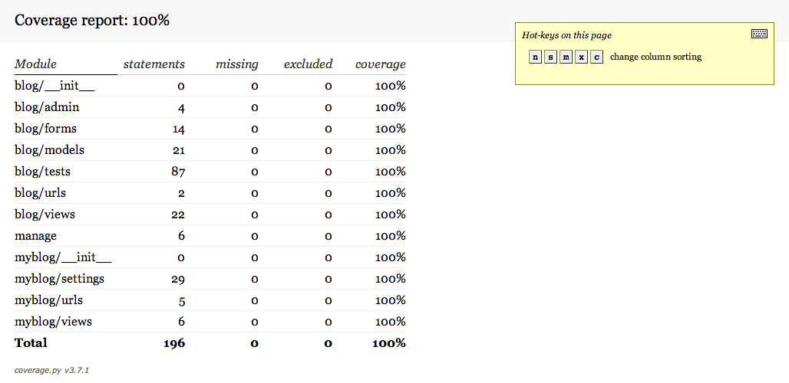
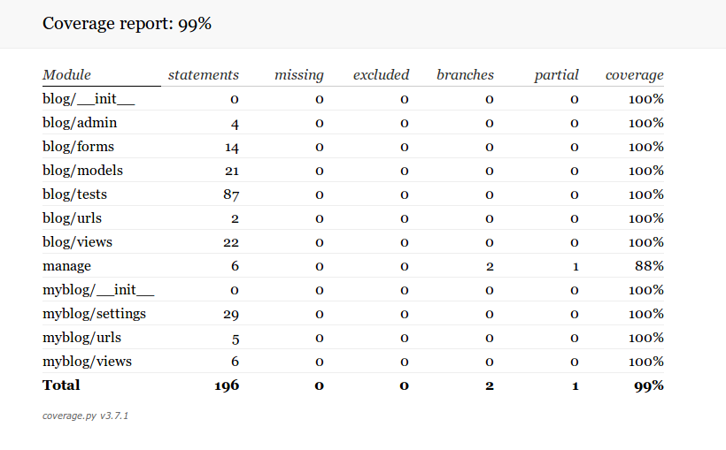
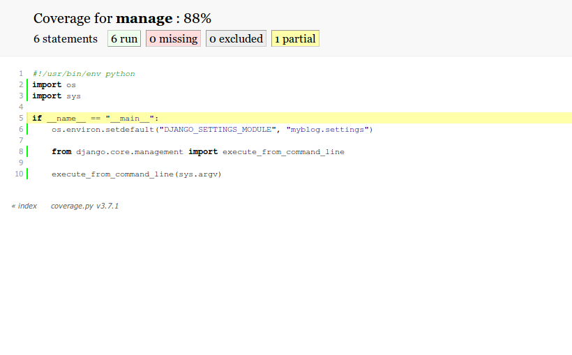

The Testing Game
================

Test Coverage
-------------

It's important to test all your code. Code coverage is frequently used
as a measuring stick for a developer's success in creating quality
tests. The basic rule of thumb is comprehensive tests should execute
every line of code.

`Coverage`_, a tool that measures code coverage for Python code, will
be used to check what percentage of the tutorial code is being tested.

Installing Coverage
------------------

First let's install coverage:

.. code-block:: bash

    $ pip install coverage

Before we continue, we need to remember to add this new dependency to
our ``requirements.txt`` file.  Let's use ``pip freeze`` to discover
the version of ``coverage`` we installed:

.. code-block:: bash

    $ pip freeze
    Django==1.7
    WebOb==1.4
    WebTest==1.4.3
    beautifulsoup4==4.3.2
    coverage==3.7.1
    django-webtest==1.7.7
    six==1.8.0
    sqlparse==0.1.13
    waitress==0.8.9

Now let's add ``coverage`` to our ``requirements.txt`` file::

    coverage==3.7.1
    Django==1.7
    WebTest==2.0.16
    django-webtest==1.7.7

Using Coverage
--------------

Now let's run our tests. As we run our tests from the command line,
``coverage`` records and creates a coverage report:

.. code-block:: bash

    $ coverage run --include='./*' manage.py test
    Creating test database for alias 'default'...
    ....................
    ----------------------------------------------------------------------
    Ran 20 tests in 0.163s

    OK
    Destroying test database for alias 'default'...

Let's take a look at our code coverage report:

.. code-block:: bash

    $ coverage report
    Name                                      Stmts   Miss  Cover
    -------------------------------------------------------------
    blog/__init__                                 0      0   100%
    blog/admin                                    4      0   100%
    blog/forms                                   14      0   100%
    blog/migrations/0001_initial                  6      0   100%
    blog/migrations/0002_auto_20141019_0232       5      0   100%
    blog/migrations/__init__                      0      0   100%
    blog/models                                  23      0   100%
    blog/tests                                  101      0   100%
    blog/urls                                     3      0   100%
    blog/views                                   18      0   100%
    manage                                        6      0   100%
    myblog/__init__                               0      0   100%
    myblog/settings                              19      0   100%
    myblog/urls                                   5      0   100%
    myblog/views                                  5      0   100%
    -------------------------------------------------------------
    TOTAL                                       209      0   100%

Let's take a look at the coverage report. On the left, the report shows
the name of the file being tested. ``Stmts``, or code statements,
indicate the number of lines of code that could be tested. ``Miss``, or
Missed lines, indicates the number of lines that are not executed by
the unit tests. ``Cover``, or Coverage, is the percentage of code
covered by the current tests (equivalent to ``(Stmts - Miss)/Stmts``).
For example, ``myblog/views`` has 18 code statements that can be tested.
We see that our tests did not miss testing any statements for a Code
Coverage of 100%.

.. IMPORTANT::

    Note that code coverage can only indicate that you've forgotten
    tests; it will not tell you whether your tests are good.  Don't use
    good code coverage as an excuse to write lower quality tests.

HTML Coverage Report
--------------------

Our current command-line coverage reports are useful, but they aren't
very detailed. Fortunately coverage includes a feature for generating
HTML coverage reports that visually demonstrate coverage by coloring
our code based on the results.

Let's prettify the coverage report above into HTML format by running
the following command:

.. code-block:: bash

    $ coverage html

This command will create a ``htmlcov`` directory containing our test
coverage. The ``index.html`` is the overview file which links to the
other files. Let's open up our ``htmlcov/index.html`` in our web
browser.

Our HTML coverage report should look something like this:

Branch Coverage
---------------

So far we've been testing statement coverage to ensure we execute every
line of code during our tests.  We can do better by ensuring every code
branch is taken.  The coverage documentation contains a good
description of `branch coverage`_.

From now on we will add the ``--branch`` argument when we record code
coverage.  Let's try it on our tests:

.. code-block:: bash

    $ coverage run --include='./*' --branch manage.py test
    $ coverage report
    Name                                      Stmts   Miss Branch BrMiss  Cover
    ---------------------------------------------------------------------------
    blog/__init__                                 0      0      0      0   100%
    blog/admin                                    4      0      0      0   100%
    blog/forms                                   14      0      0      0   100%
    blog/migrations/0001_initial                  6      0      0      0   100%
    blog/migrations/0002_auto_20141019_0232       5      0      0      0   100%
    blog/migrations/__init__                      0      0      0      0   100%
    blog/models                                  23      0      0      0   100%
    blog/tests                                  101      0      0      0   100%
    blog/urls                                     3      0      0      0   100%
    blog/views                                   18      0      0      0   100%
    manage                                        6      0      2      1    88%
    myblog/__init__                               0      0      0      0   100%
    myblog/settings                              19      0      0      0   100%
    myblog/urls                                   5      0      0      0   100%
    myblog/views                                  5      0      0      0   100%
    ---------------------------------------------------------------------------
    TOTAL                                       209      0      2      1    99%

Notice the new ``Branch`` and ``BrMiss`` columns and note that we are
missing a branch in our ``manage.py`` file. We'll take a look at that
later.

Coverage Configuration
----------------------

Coverage allows us to specify a configuration file (``.coveragerc``
files) to specify default coverage attributes. The documentation
explains how `.coveragerc`_ work.

Let's add a ``.coveragerc`` file to our project that looks like this::

    [run]
    include = ./*
    branch = True

Now we can run coverage without any extra arguments:

.. code-block:: bash

    $ coverage run manage.py test

Inspecting Missing Coverage
---------------------------

Now let's figure out why our branch coverage is not 100%. First we need
to regenerate the HTML coverage report and have a look at it:

.. code-block:: bash

    $ coverage html

Let's click on ``manage`` to see why our manage.py file has 88%
coverage:

We're missing the ``False`` case for that ``if`` statement in our
``manage.py`` file.  We always run ``manage.py`` from the command line
so that code is always executed.

We don't intend to ever test that missing branch, so let's ignore the
issue and accept our imperfect coverage statistics.

.. TIP::

    For extra credit, figure out how we can exclude that
    ``if __name__ == "__main__":`` line from our coverage count. Check
    out the `.coveragerc`_ documentation for help.

.. _coverage: http://nedbatchelder.com/code/coverage/
.. _branch coverage: http://nedbatchelder.com/code/coverage/branch.html
.. _.coveragerc: http://nedbatchelder.com/code/coverage/config.html
